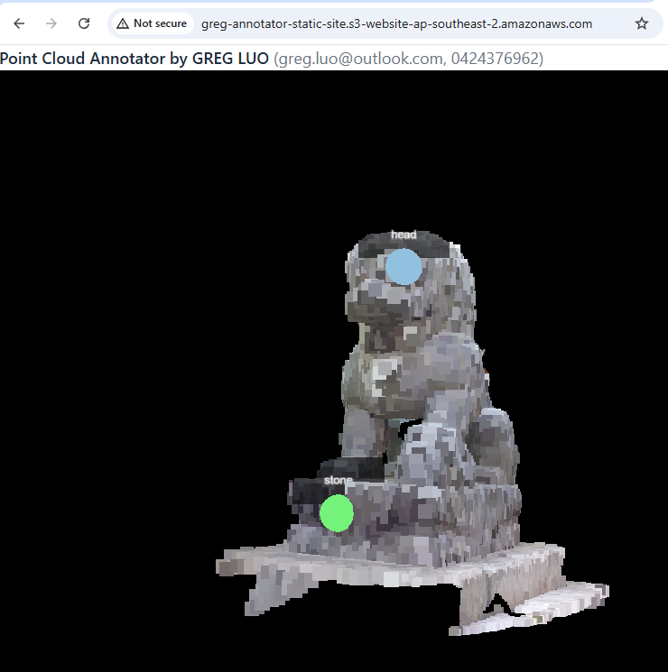
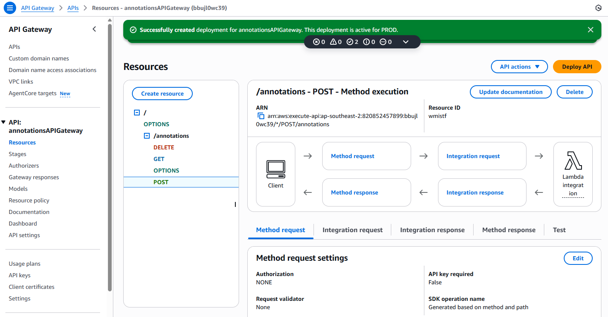
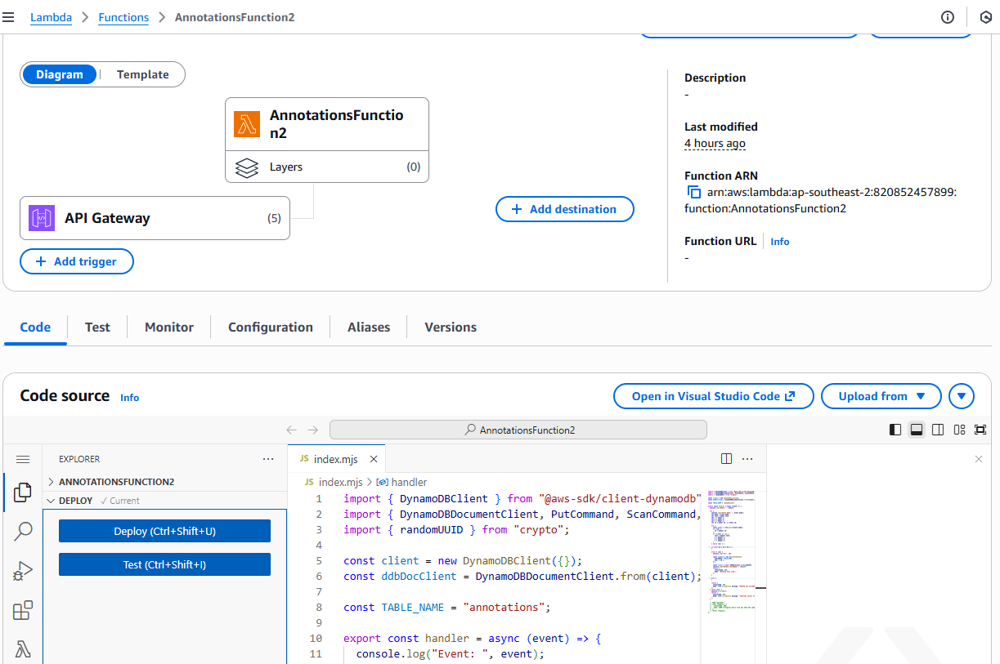
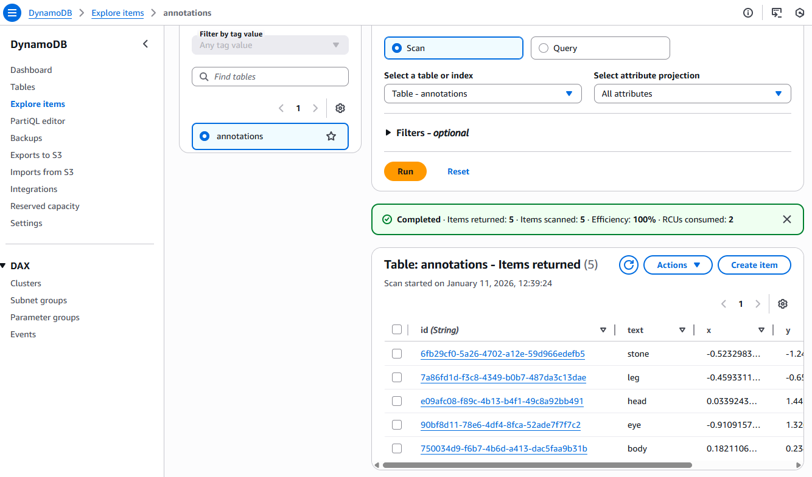

# Point Cloud Annotator by GREG LUO

greg.luo@outlook.com, 0424376962

---

## Deployed application

### Front end

The app is hosted as a static website on an AWS S3 bucket:
http://greg-annotator-static-site.s3-website-ap-southeast-2.amazonaws.com/

### Back end

It is implemented via API Gateway to trigger a Lambda function that reads from and writes to DynamoDB
https://bbujl0wc39.execute-api.ap-southeast-2.amazonaws.com/PROD/annotations

---

## Steps to run the project locally

Github repo: https://github.com/GregLuoDev/Annotator

- "yarn" to install dependencies
- "ng build --configuration production" to build for production
- "yarn start" to run the app and then access it at browser with address "http://localhost:4200/"
- "yarn test" to run test cases

---

## Technical choices

### Front end

S3, Angular 21, @pnext/three-loader, three.js

### Back end

API Gateway, Lambda, DynamoDB

